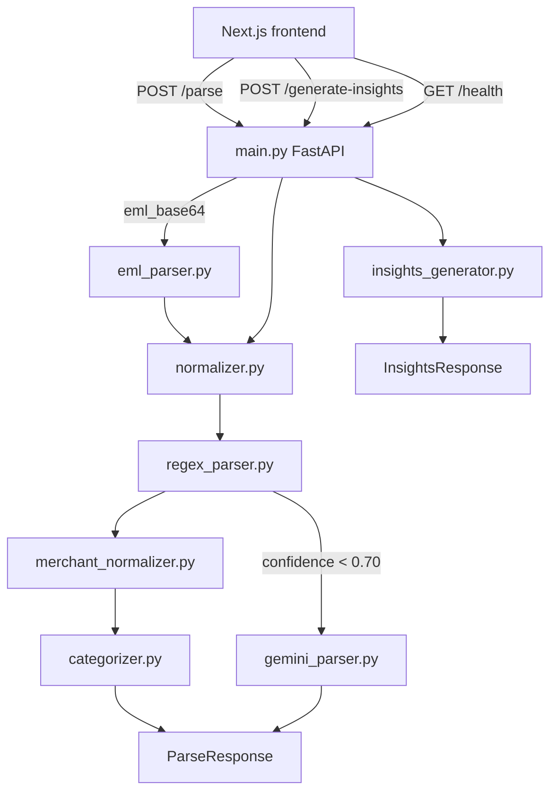

# YouthPay - Python AI Service

A standalone FastAPI microservice at `ai-service/` (repo root, sibling to the Next.js app) that Next.js calls over HTTP. It parses Pakistani bank SMS/email notifications and generates AI insights. It never connects to any database.

## Architecture

## Files to create (all under `ai-service/`)

- `requirements.txt` - exact deps: fastapi, uvicorn[standard], google-generativeai, python-multipart, pydantic, python-dateutil, python-dotenv, pytest
- `.env.example` - `GEMINI_API_KEY=your_key_here`
- `models.py` - Pydantic v2 models: `ParseRequest`, `ParseResponse`, `InsightsRequest`, `InsightsResponse`, `InsightCard`, `TransactionStats`, `MerchantStat`. Uses `Literal[...] | None` for `direction`, `payment_method`, `parsed_by`; all optional fields `Optional[type] = None`.
- `normalizer.py` - `normalize(text) -> str`: regex HTML strip (no BeautifulSoup), UTF-8 then latin-1 decode fallback, collapse all whitespace to single space, trim.
- `eml_parser.py` - `parse_eml(b64) -> dict`: base64 decode, `BytesParser(policy=email.policy.default)`, extract subject/sender/date/body, prefer text/plain over text/html (strip HTML via normalizer), return `{subject, sender, date, body}`.
- `regex_parser.py` - `parse(raw_text, source) -> tuple[dict, float]`: amount `(?:Rs\.?|PKR)\s*([\d,]+(?:\.\d{1,2})?)`, debit/credit keyword sets (incl. Roman Urdu: katay, gaye, aaya, mila), merchant patterns (at/to/from-if-credit/merchant:), payment-method detection (source/sender first then body), date formats (DD-Mon-YYYY, DD/MM/YYYY, YYYY-MM-DD) via `dateutil` -> ISO. Confidence: amount +0.40, direction +0.35, merchant +0.25.
- `gemini_parser.py` - `parse_with_gemini(raw_text) -> dict`: `gemini-1.5-flash`, exact system instruction + prompt from spec, strip markdown fences before `json.loads`, full try/except returning all-null + confidence 0.0 + `parsed_by="gemini"`. Never raises.
- `categorizer.py` - `categorize(merchant_name) -> str`: substring keyword map from spec, default `"Other"`.
- `merchant_normalizer.py` - `normalize_merchant(name) -> str`: exact alias map (lowercased key -> canonical), else title-case.
- `duplicate_detector.py` - `detect_duplicates(batch, existing) -> list`: mark LATER txn `is_duplicate=True` when same normalized merchant + same amount + `txn_date` within 5 minutes (uses `dateutil` for parsing/timedelta).
- `insights_generator.py` - `generate_insights(stats) -> list`: `gemini-1.5-flash`, exact system/user prompts, always 4 cards, hardcoded 4-card fallback on any failure. Never raises.
- `main.py` - FastAPI app, CORS allow-all, loads `GEMINI_API_KEY` via `os.getenv` (+ `python-dotenv`). Implements the exact `/parse` pipeline (eml -> normalize -> regex -> merchant_normalizer -> categorizer -> gemini-merge-if-low-confidence), `/generate-insights`, `/health`. `/parse` wrapped so it NEVER returns 500. `__main__` runs uvicorn on `0.0.0.0:8000`.
- `test_parser.py` - pytest tests 1-5 from spec (English debit, English credit, Roman Urdu via Gemini, mixed language via Gemini, duplicate detection).

## Key implementation details / decisions

- **Gemini merge rule** (`/parse` step 6): when regex confidence < 0.70, call Gemini; Gemini non-null fields override regex, but regex values are kept wherever Gemini returns null. `parsed_by` becomes `"gemini"` only when Gemini actually ran successfully; on Gemini exception, keep regex result (Rule 3).
- **Gemini tests (3 & 4)**: these require a real `GEMINI_API_KEY` to pass the `parsed_by == "gemini"` / Roman-Urdu assertions. I'll write them as specified; they'll be skippable/xfail-guarded if no API key is present so the regex tests (1, 2, 5) always run offline. I'll note this in the test file.
- **Placement**: `ai-service/` lives at repo root. The existing Next.js `[src/lib/gemini.ts](src/lib/gemini.ts)` placeholder is left as-is (frontend HTTP client wiring is out of scope unless you want it).

## Verification

- `cd ai-service && python -m venv .venv && source .venv/bin/activate && pip install -r requirements.txt`
- `pytest test_parser.py` (regex + duplicate tests pass offline; Gemini tests run when `GEMINI_API_KEY` set)
- `uvicorn main:app --port 8000` then smoke-test `/health`, `/parse`, `/generate-insights`

## Out of scope (per spec)

No DB, no LangChain/LangGraph, no embeddings/vector DB. No changes to the Next.js app beyond the new folder.