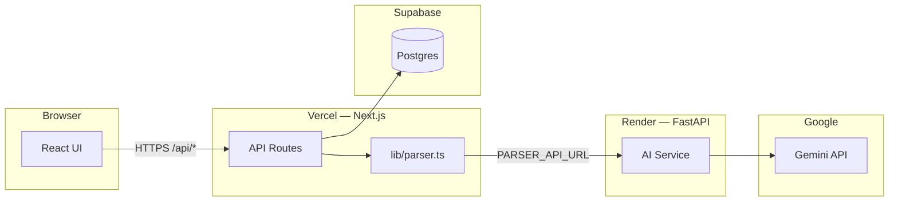
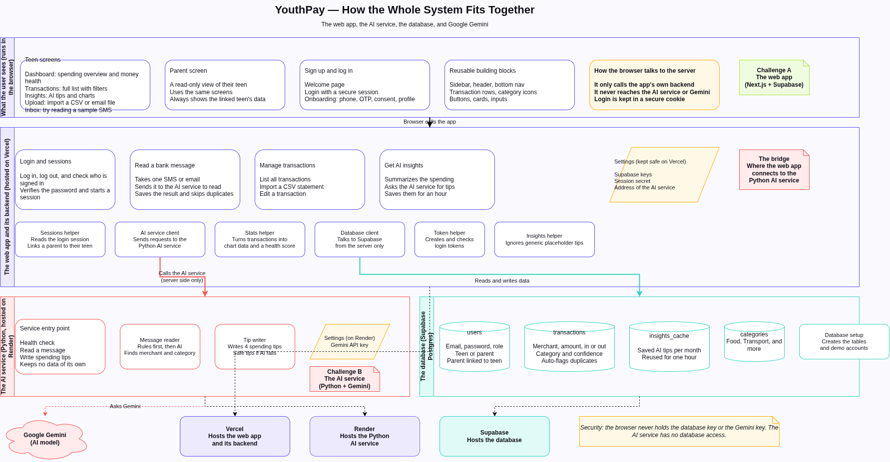
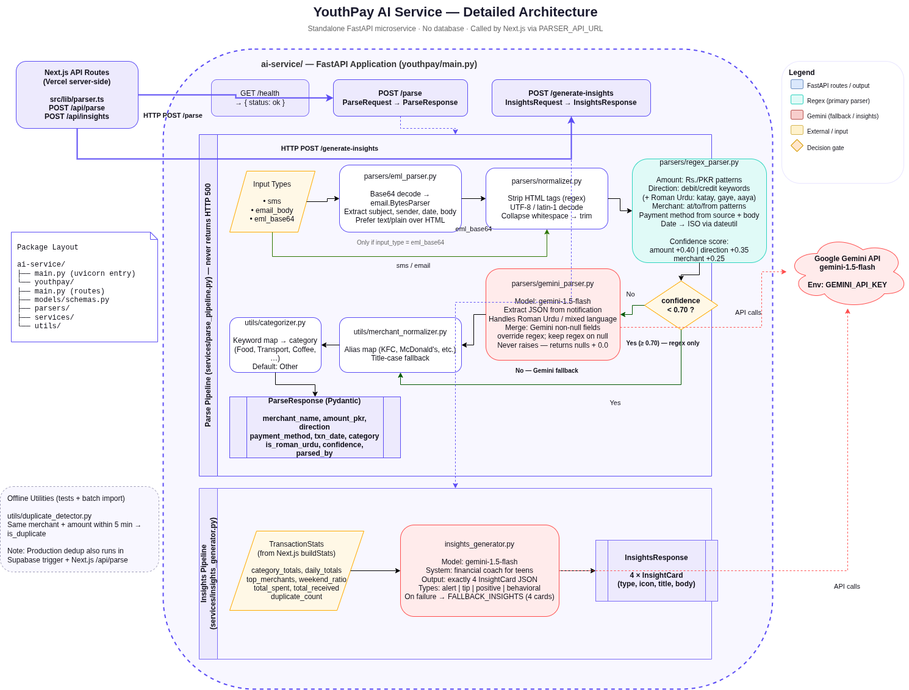
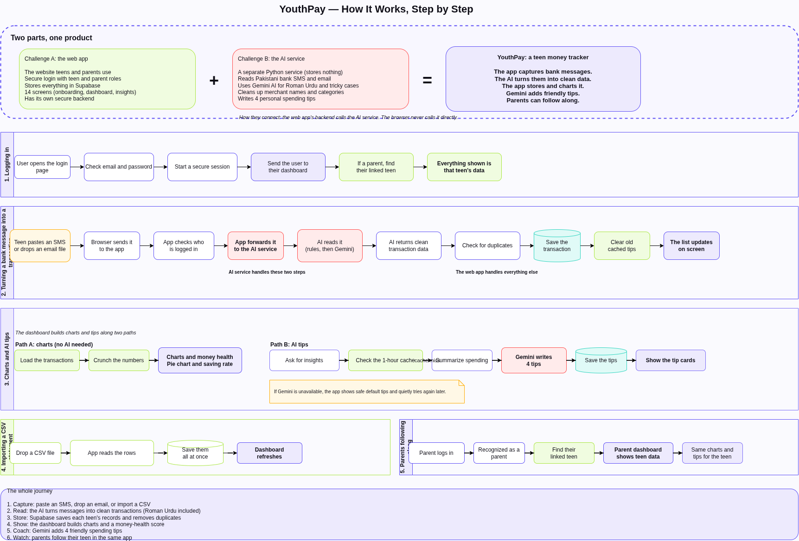
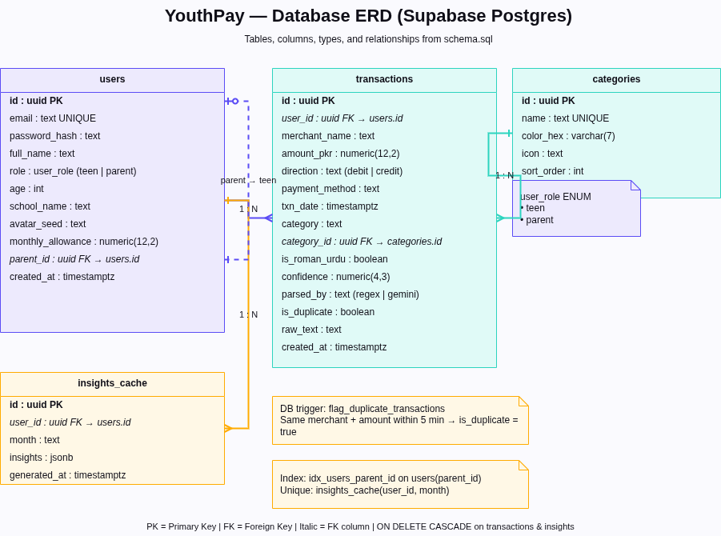

<p align="center">
  <strong style="font-size: 2rem;">YouthPay</strong><br/>
  <em>Teen finance tracker for Pakistan — parse bank notifications, visualize spending, get AI coaching insights.</em>
</p>

<p align="center">
  
  
  
  
  
  
  
</p>

> **Before running the frontend:** start the AI backend on Render first (free tier sleeps when idle). Open the [Render service dashboard](https://dashboard.render.com/web/srv-d90h6hmgvqtc739hc2ag/deploys/dep-d90h6i6gvqtc739hc320), confirm the latest deploy is **Live**, and wait until `/health` responds — then run `npm run dev`. Parsing and insights need this service; the UI alone is not enough.

---

## Table of contents

- [Overview](#overview)
- [Architecture diagrams](#architecture-diagrams)
- [How both challenges combine](#how-both-challenges-combine)
- [Tech stack](#tech-stack)
- [Project structure](#project-structure)
- [Features & screens](#features--screens)
- [Quick start](#quick-start)
- [Deployment (Vercel + Render)](#deployment-vercel--render)
- [API reference](#api-reference)
- [Demo accounts](#demo-accounts)
- [Environment variables](#environment-variables)

---

## Overview

YouthPay helps Pakistani teenagers understand their money. Teens paste bank SMS messages, upload `.eml` email exports, or import CSV statements. A **Python AI service** extracts structured transaction data (including Roman Urdu). A **Next.js application** stores records in **Supabase**, renders dashboards and charts, and surfaces **Gemini-powered spending insights**. Parents can log in and monitor a linked teen's activity.



> **Production topology:** Frontend on **Vercel**, AI service on **Render**, database on **Supabase**. The browser never calls Render or Gemini directly.

---

## Architecture diagrams

### System architecture — how the whole system fits together

The web app (Vercel), the AI service (Render), the database (Supabase), and Google Gemini, and how they connect.



### AI service — how it reads a bank message

Inside the Python service: cleaning the text, reading it with rules first, asking Gemini only when unsure, then categorizing and returning structured data. It also writes the spending tips.



### Application flow — step by step

How the two parts combine, plus the main user flows: logging in, parsing a message, building charts and AI tips, CSV import, and parents following along.



### Database ERD — Supabase Postgres schema

Tables, columns, foreign keys, and relationships (`users`, `transactions`, `categories`, `insights_cache`).



<details>
<summary><strong>Editing the diagrams (click to expand)</strong></summary>

The editable sources live alongside the images in the repo root:

| Diagram | Source | Image |
|---------|--------|-------|
| System architecture | [`application-architecture.drawio`](./application-architecture.drawio) | [`application-architecture.png`](./application-architecture.png) |
| AI service | [`ai-service-architecture.drawio`](./ai-service-architecture.drawio) | [`ai-service-architecture.png`](./ai-service-architecture.png) |
| Application flow | [`application-flow.drawio`](./application-flow.drawio) | [`application-flow.png`](./application-flow.png) |
| Database ERD | [`database-erd.drawio`](./database-erd.drawio) | [`database-erd.png`](./database-erd.png) |

- **VS Code / Cursor:** install the [Draw.io Integration](https://marketplace.visualstudio.com/items?itemName=hediet.vscode-drawio) extension and open any `.drawio` file inline.
- **Web:** open the `.drawio` file at [diagrams.net](https://app.diagrams.net) (File → Open from → Device).
- **Re-export:** after editing, File → Export as → PNG to refresh the image used here.

</details>

---

## How both challenges combine

YouthPay merges two deliverables into one production-ready product:

| | Challenge A — Full-stack application | Challenge B — Python AI service |
|---|--------------------------------------|----------------------------------|
| **Scope** | Next.js 15 UI, JWT auth, Supabase, API routes, 14 screens | FastAPI parser + Gemini insights, stateless microservice |
| **Key paths** | `src/app/`, `src/lib/auth.ts`, `supabase/schema.sql` | `ai-service/youthpay/` |
| **Responsibility** | Capture input, authenticate users, persist data, render charts | Extract PKR transactions from SMS/email, generate insight cards |

**Integration point:** `src/lib/parser.ts` — called only from Next.js API routes (`/api/parse`, `/api/insights`) using the server-side `PARSER_API_URL`. Challenge A owns persistence and UX; Challenge B owns intelligence.

```
Challenge A (UI + DB)  +  Challenge B (AI)  =  YouthPay
        │                        │
        └──── parser.ts bridge ──┘
```

See [`application-flow.drawio`](./application-flow.drawio) for step-by-step flows with challenge labels on each step.

---

## Tech stack

| Layer | Technology | Purpose |
|-------|------------|---------|
| Frontend | Next.js 15, React 19, Tailwind CSS | App Router, 14 screens, responsive teen UI |
| Backend (BFF) | Next.js API Routes | Auth, transactions, proxy to AI service |
| Auth | Custom JWT + bcrypt | `yp_token` cookie; teen / parent roles |
| Database | Supabase (Postgres only) | Users, transactions, insights cache |
| AI service | Python 3.12, FastAPI, uvicorn | Parse + insights endpoints |
| LLM | Google Gemini 2.5 Flash | Roman Urdu parsing fallback + insight cards |
| Deploy | Vercel + Render | Frontend + AI microservice |

---

## Project structure

```
ht-youthpay/
├── ai-service/                    # Challenge B — Python AI microservice
│   ├── main.py                    # uvicorn entry (PORT from env)
│   ├── requirements.txt
│   └── youthpay/
│       ├── main.py                # FastAPI routes
│       ├── models/schemas.py      # Pydantic models
│       ├── parsers/               # regex, gemini, eml, normalizer
│       ├── services/              # parse_pipeline, insights_generator
│       └── utils/                 # categorizer, merchant_normalizer, dedup
├── src/
│   ├── app/
│   │   ├── (auth)/                # Welcome, login, onboarding
│   │   ├── (dashboard)/           # Dashboard, transactions, insights…
│   │   └── api/                   # REST API (auth, parse, transactions, insights)
│   ├── components/                # UI + dashboard components
│   └── lib/                       # auth, parser client, aggregator, jwt
├── supabase/schema.sql            # Postgres schema + demo seed data
├── render.yaml                    # Render Blueprint for AI service
├── ai-service-architecture.drawio
├── application-architecture.drawio
└── application-flow.drawio
```

---

## Features & screens

<details>
<summary><strong>Auth & onboarding</strong></summary>

| Route | Screen |
|-------|--------|
| `/` | Welcome |
| `/login` | Login (JWT) |
| `/onboarding/phone` | Phone entry |
| `/onboarding/otp` | OTP verification |
| `/onboarding/consent` | Parent consent |
| `/onboarding/profile` | Profile setup |
| `/onboarding/success` | Onboarding complete |

</details>

<details>
<summary><strong>Dashboard (login required)</strong></summary>

| Route | Screen |
|-------|--------|
| `/dashboard` | Teen overview, health score, charts |
| `/transactions` | Transaction list with filters |
| `/insights` | AI insight cards + spending visuals |
| `/inbox` | Simulated SMS — live parse demo |
| `/upload` | CSV + `.eml` import |
| `/parent` | Parent view of linked teen |

</details>

<details>
<summary><strong>Core capabilities</strong></summary>

- **Parse Pakistani bank notifications** — JazzCash, HBL, Meezan, NayaPay, Roman Urdu text
- **Regex-first, Gemini-fallback** — confidence threshold 0.70
- **Duplicate detection** — same merchant + amount within 5 minutes (app + DB trigger)
- **Deterministic stats** — pie chart, health score, saving rate from `buildStats()`
- **AI insight cards** — 4 personalized cards with 1-hour cache
- **Parent ↔ teen linking** — `getDataUserId()` maps parent session to teen data

</details>

---

## Quick start

### Prerequisites

- Node.js 20+
- Python 3.12+
- Supabase project ([create one free](https://supabase.com))

### 1. Clone and configure

```bash
git clone <your-repo-url>
cd ht-youthpay
cp .env.example .env.local
```

Fill in Supabase URL/keys and `JWT_SECRET`. Apply [`supabase/schema.sql`](./supabase/schema.sql) in the Supabase SQL editor.

### 2. Start the AI backend (Render)

Before starting the frontend, wake the deployed AI service:

1. Open the [Render service dashboard](https://dashboard.render.com/web/srv-d90h6hmgvqtc739hc2ag/deploys/dep-d90h6i6gvqtc739hc320).
2. Confirm the latest deploy status is **Live** (free tier may take 30–60s to wake after idle).
3. Ensure `PARSER_API_URL` in `.env.local` points to your Render service URL.

For local AI development instead, see [step 4 below](#4-ai-service-local-optional).

### 3. Frontend

```bash
npm install
npm run dev
```

App runs at **http://localhost:3000**

### 4. AI service (local, optional)

```bash
cd ai-service
python -m venv .venv
source .venv/bin/activate   # Windows: .venv\Scripts\activate
pip install -r requirements.txt
cp .env.example .env
# Set GEMINI_API_KEY in ai-service/.env
python main.py
```

AI service runs at **http://localhost:8000** — verify with `curl http://localhost:8000/health`

### 5. Run tests (AI service)

```bash
cd ai-service && source .venv/bin/activate
pytest tests/
```

---

## Deployment (Vercel + Render)

| Service | Platform | Root / config |
|---------|----------|---------------|
| Frontend + API | [Vercel](https://vercel.com) | Repo root, Next.js preset |
| AI service | [Render](https://render.com) | `ai-service/` or root [`render.yaml`](./render.yaml) |
| Database | Supabase | Same project for local + prod |

<details>
<summary><strong>Render — AI service setup</strong></summary>

1. Push repo to GitHub.
2. Render → **New → Blueprint** (uses `render.yaml`) **or** **Web Service**:
   - Root directory: `ai-service`
   - Build: `pip install -r requirements.txt`
   - Start: `uvicorn youthpay.main:app --host 0.0.0.0 --port $PORT`
   - Health check: `/health`
3. Set `GEMINI_API_KEY`.
4. Copy service URL (e.g. `https://youthpay-ai.onrender.com`).

> Render free tier sleeps when idle. First request after sleep may take 30–60s.

</details>

<details>
<summary><strong>Vercel — frontend setup</strong></summary>

1. Import GitHub repo → Next.js preset.
2. Add environment variables (see [Environment variables](#environment-variables)).
3. Set `PARSER_API_URL` to your Render URL (no trailing slash).
4. Deploy.

</details>

---

## API reference

### Next.js (browser → Vercel)

| Method | Path | Description |
|--------|------|-------------|
| POST | `/api/auth/login` | Email/password → JWT cookie |
| POST | `/api/auth/logout` | Clear session |
| GET | `/api/auth/me` | Current user profile |
| POST | `/api/parse` | Parse SMS/email/EML → store transaction |
| GET | `/api/transactions` | List user transactions |
| POST | `/api/transactions/import` | Bulk CSV import |
| PATCH | `/api/transactions/[id]` | Update transaction |
| POST | `/api/insights` | AI insight cards (`refresh?: boolean`) |

### Python AI service (Vercel → Render, server-side only)

| Method | Path | Description |
|--------|------|-------------|
| GET | `/health` | `{ "status": "ok" }` |
| POST | `/parse` | Extract transaction from raw notification |
| POST | `/generate-insights` | 4 insight cards from `TransactionStats` |

---

## Demo accounts

| Role | Email | Password |
|------|-------|----------|
| Teen | `sudais@youthpay.test` | `testpass123` |
| Parent | `parent@youthpay.test` | `testpass123` |

Parent login resolves to Sudais's transaction data via `users.parent_id`.

---

<p align="center">
  <sub>Built for Pakistani teens · Regex + Gemini · Vercel + Render + Supabase</sub>
</p>
